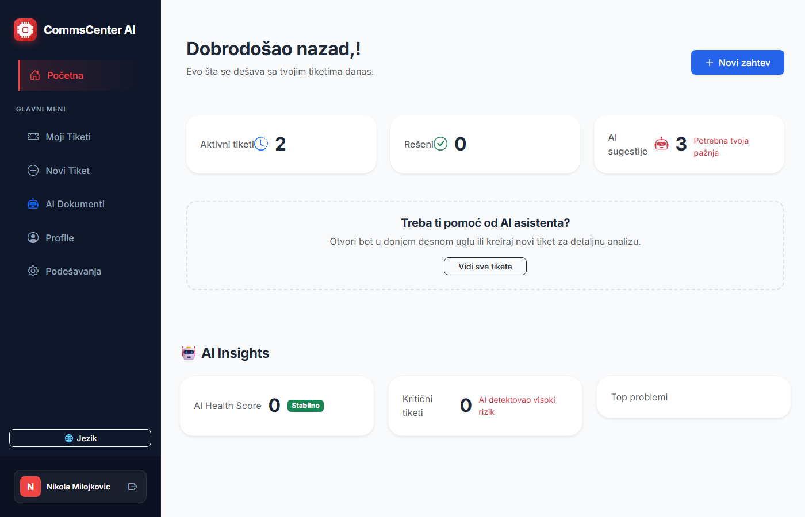
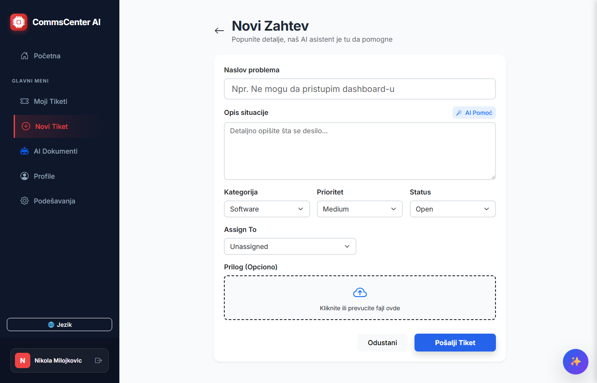
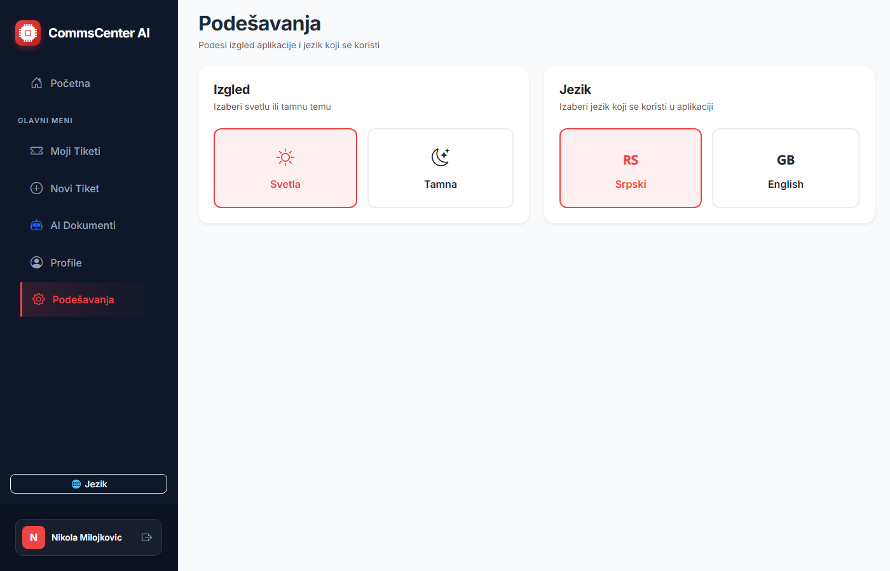

# TicketSystem UI

Blazor WebAssembly frontend for the TicketSystem platform. Features AI-powered ticket management, document RAG Q&A, real-time notifications, and full localization.

> Backend repo: [ticket-system-api](https://github.com/nikolamilojkovic123/ticket-system-api)

---

## Screenshots

### Dashboard


### Create Ticket


### Settings


---

## Tech Stack

**Framework:** Blazor WebAssembly (.NET 10)  
**Auth:** Google OAuth redirect flow · JWT (localStorage)  
**Real-time:** SignalR client (WebSocket notifications)  
**Localization:** IStringLocalizer (Serbian / English)  
**Theming:** Light / Dark mode (persisted in localStorage)  
**Serving:** nginx  
**Deployment:** Docker  

---

## Features

- **Ticket Management** — Create, update, filter, search tickets with AI assistance
- **AI Chat Assistant** — Floating drawer with OpenAI-powered chat
- **Document RAG Q&A** — Upload documents, ask questions, listen to AI-generated audio responses
- **Real-time Notifications** — SignalR-powered notification panel with unread count
- **Dashboard** — Active tickets, resolved count, AI insights, top keywords
- **Admin Panel** — Per-user statistics, resolution rates, top performers
- **User Profile** — View and edit profile information
- **Localization** — Full Serbian and English support with language switcher
- **Dark Mode** — Light/dark theme toggle

---

## Project Structure

```
TicketSystem.UI/
├── Components/
│   ├── Admin/           → Admin panel with user stats
│   ├── Settings/        → Theme and language settings
│   ├── Tickets/         → Ticket list, create form
│   ├── UserProfile/     → Profile page
│   └── Shared/
│       ├── AiAssistant/ → AI chat, document Q&A, message bubbles
│       └── Notifications/ → Real-time notification panel
├── Layout/              → MainLayout, NavMenu, Index (dashboard)
├── Models/              → DTOs and view models
├── Services/            → API clients, SignalR, auth, theme, toast
├── Interfaces/          → Service contracts
├── Enums/               → Ticket status, priority, category
├── Resources/           → .resx localization files (SR/EN)
└── wwwroot/             → Static assets, CSS, index.html
```

---

## Running Locally

### With Docker (via backend docker-compose)

```bash
git clone https://github.com/nikolamilojkovic123/ticket-system-api.git
cd ticket-system-api
docker-compose up --build
```

UI will be available at http://localhost:4200

### Standalone

```bash
git clone https://github.com/nikolamilojkovic123/ticket-system-ui.git
cd ticket-system-ui
dotnet run --project TicketSystem.UI
```

Requires the backend API running at `http://localhost:5075`.
